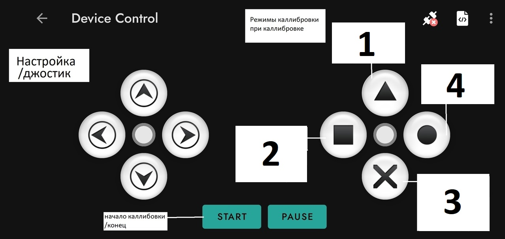

# Инстукция по каллибровке

# Меню управления машинкой

## Начало калибровки / Конец
Кнопка **"Начало калибровки/Конец"** служит для переключения между двумя режимами: 
- **Калибровка параметров** - настройка работоспособности машинки
- **Обычное управление** - управление машинкой через джостик

В режиме калибровки вы сможете точно настроить, как реагируют колеса на ваши команды, чтобы левое колесо всегда оставалось левым, а правое — правым.

## Настройка / Джостик
Первый джостик отвечает за настройку параметров машинки или управление ею. При включении режима калибровки он активирует режим настройки, где кнопки вверх, вниз, влево и вправо управляют различными параметрами в зависимости от выбранного режима второго джостика. 

Когда вы завершаете калибровку, этот джостик переходит в режим управления, позволяя вам легко маневрировать машинкой.

## Второй джостик — Режимы калибровки
Второй джостик переключает между четырьмя режимами калибровки, представленными кнопками: 
- **1 Треугольник**
- **2 Квадрат**
- **3 Крестик**
- **4 Круг**

Каждая из этих кнопок соответствует определенной функции, и мы подробно опишем их ниже (они пронумерованы от 1 до 4 в дальнейшей инструкции).
## Подробное описание кнопок управления
### Общие описания кнопок
1. **Кнопка 1(Треугольник): Настройка левого колеса**
   - Эта кнопка активирует режим, в котором управление осуществляется с помощью стрелок на первом джойстике. Нужно выбрать Левое колесо(то что двигается то и будет левым)

     - **Левая стрелка**: переключает крутящееся колесо на противоположное.
     - **Правая стрелка**: переключает крутящееся колесо на противоположное.

2. **Кнопка 2(Квадрат): Настройка направления колес**
   - Эта кнопка позволяет настроить направление движения обоих колес для движения вперед.
     - **Стрелка вправо**: управляет направлением правого колеса.
     - **Стрелка влево**: управляет направлением правого колеса.
     - **Стрелка вверх**: задает направление движения для левого колеса.
     - **Стрелка вниз**: задает направление движения для левого колеса.

3. **Кнопка 3(Крестик): Настройка времени поворота**
   - Эта кнопка предназначена для настройки времени поворота машинки.
     - **Левая стрелка**: включает левый поворот на заданное время.
     - **Правая стрелка**: включает правый поворот на заданное время.
     - **Стрелка вверх**: увеличивает длительность поворота.
     - **Стрелка вниз**: уменьшает длительность поворота.

4. **Кнопка 4(Круг): Настройка соотношения колес**
   - Эта кнопка отвечает за настройку соотношения скорости вращения колес.
   - Формула для расчета соотношения скорости:
     [
     \text{Скорость}_{\text{лев}} = k \times \text{Скорость}_{\text{прав}}
     ]
     где ( k ) — коэффициент соотношения (например, 1.0 для равной скорости, 0.5 для половинной скорости и т.д.).
   - Пояснение:
     - **Левая стрелка**: уменьшает скорость вращения левого колеса относительно правого.
     - **Правая стрелка**: увеличивает скорость вращения левого колеса относительно правого.
     - **Стрелка вверх/вниз**: не используется.

# Демонстрация работы

Увидеть работу устройства можно по [ссылке](https://drive.google.com/file/d/1Y9E_Olo8eHI8USf2IvyDPAEw5403VMSq/view?usp=sharing)
