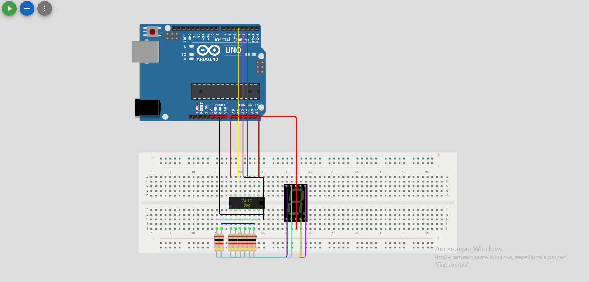

# Использование

- Соберите датчик согласно [схеме](shiftregisters_matrix.pdf) или [симулятору](https://www.tinkercad.com/things/51zZE3pT7xg/editel?returnTo=%2Fdashboard)
- Подключите плату к питанию и загрузите в неё [скетч](shiftregisters_matrix.ino)
- После запуска скетча вы увидите на матрице иконку в виде сердца, которая будет меняться на волка и обратно раз в 3 секунды.

# Демонстрация работы

- Увидеть работу устройства с циферблатом можно по [ссылке](https://drive.google.com/file/d/1l0ke3oEgSJshuSIaiZR-5_vBYH-vz-Oy/view?usp=sharing)
- Увидеть работу устройства с матрицей можно по [ссылке](https://drive.google.com/file/d/1l02-8tL6PcBJrOh6tqt1yPrROL46Uszr/view?usp=sharing)

# Аудиторное занятие
- Код - [скетч](clock_face.ino)
- 
